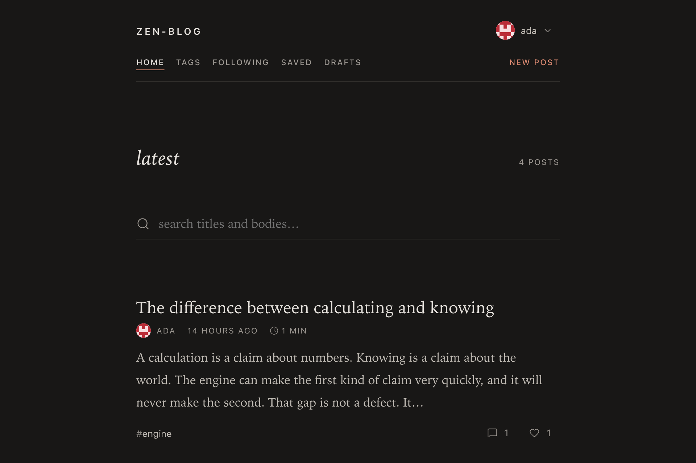
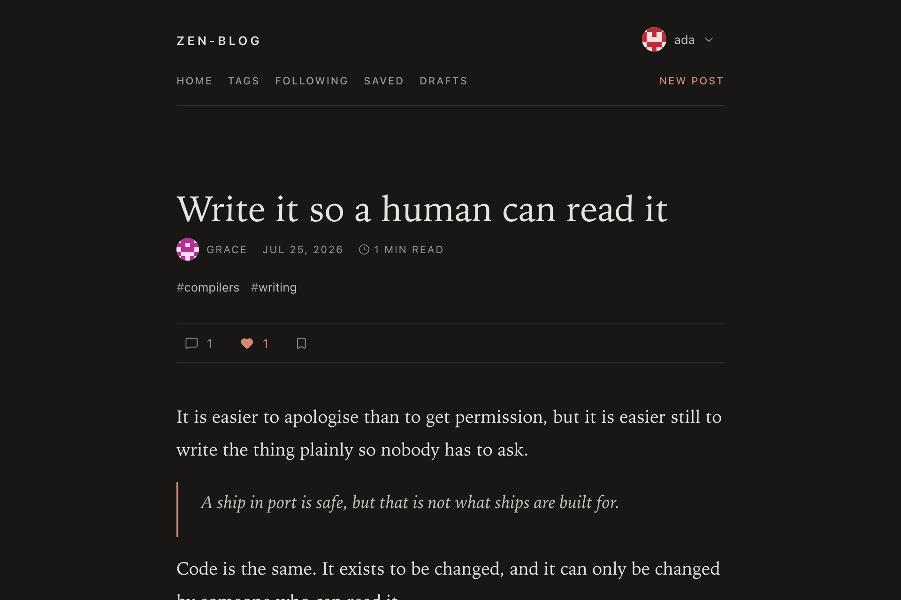
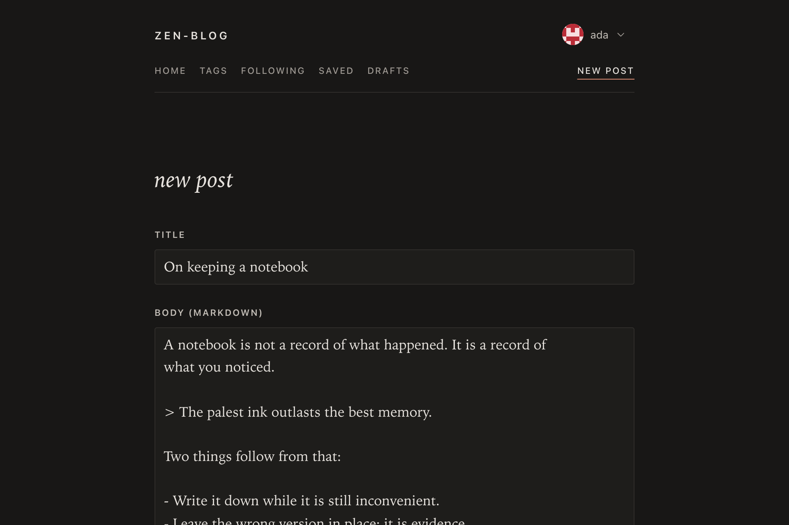
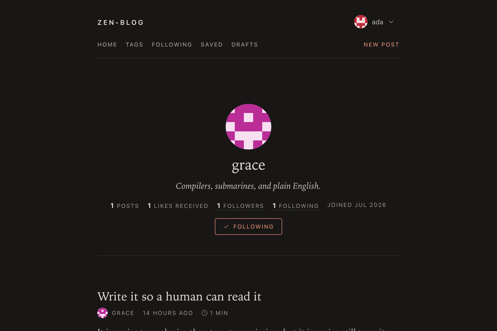

<div align="center">


# zen-blog

**A quiet, paper-like place to write. Multi-user blogging on Flask and htmx —
server-rendered, no JavaScript of its own, no build step.**

[**Try it live**](https://prod-zen-blog.onrender.com)

[](LICENSE)
[](https://www.python.org/)
[](https://flask.palletsprojects.com/)
[](https://htmx.org/)

</div>

---

## What this is

A small multi-user blogging site: register, write posts in Markdown, tag them,
follow other authors, like, save and comment. Everything is rendered on the
server. There is **no hand-written JavaScript and no front-end build step** — the
only script on the page is a vendored copy of [htmx](https://htmx.org/), which
turns ordinary links and forms into partial page updates.

Every interactive control is a real `<a href>` or `<form method="post">` first.
htmx attributes are layered on top, so with JavaScript disabled the site still
works — it just does full page loads instead of swapping fragments.

It is also an exercise in restraint on the front end: one stylesheet, one icon
sprite, no fonts downloaded, and no images beyond the site icon.

## Screenshots

<table>
  <tr>
    <td width="50%"></td>
    <td width="50%"></td>
  </tr>
</table>

<details>
<summary>More screenshots</summary>

<table>
  <tr>
    <td width="50%"></td>
    <td width="50%"></td>
  </tr>
</table>

</details>

## Features

**Writing**

- Markdown posts with fenced code blocks, tables and quotes, sanitized server-side with [`nh3`](https://github.com/messense/nh3)
- Drafts — write privately, publish when ready
- Tags, with per-tag filtering and a tag index
- SEO-friendly slugs derived from the title, de-duplicated automatically
- Estimated reading time

**Reading**

- Posts are public; no login wall in front of the content
- Search-as-you-type across titles and bodies, with a shareable URL
- "Load more" pagination that appends instead of navigating
- RSS feed, `sitemap.xml` and `robots.txt`
- Light / dark / follow-system switch. The choice is a cookie the server reads,
  not a script, so it persists across pages and never flashes the wrong theme

**Social**

- Follow authors and read a feed of just their posts
- Likes and a personal reading list (saved posts)
- Comments, added and removed in place
- Profiles with bios and deterministic identicon avatars generated from the username — nothing to upload, nothing to store

## Tech Stack

| Area           | Tools                                                                                                      |
| -------------- | ---------------------------------------------------------------------------------------------------------- |
| **Framework**  | [Flask 3](https://flask.palletsprojects.com/) · [Jinja2](https://jinja.palletsprojects.com/)                |
| **Front end**  | [htmx 2](https://htmx.org/) + [flask-htmx](https://flask-htmx.readthedocs.io/) · one hand-written CSS file, system fonts · [Lucide](https://lucide.dev/) icons as an SVG sprite |
| **Database**   | [SQLAlchemy 2](https://www.sqlalchemy.org/) · SQLite by default, any URL via `DATABASE_URL`                 |
| **Migrations** | [Alembic](https://alembic.sqlalchemy.org/) via [Flask-Migrate](https://flask-migrate.readthedocs.io/)      |
| **Auth**       | [Flask-Login](https://flask-login.readthedocs.io/) · [Flask-WTF](https://flask-wtf.readthedocs.io/) CSRF    |
| **Tooling**    | [uv](https://docs.astral.sh/uv/) · [Ruff](https://docs.astral.sh/ruff/) · [pytest](https://pytest.org/)     |
| **Deployment** | [Docker](https://www.docker.com/) · [gunicorn](https://gunicorn.org/)                                      |

## Getting Started

You need [uv](https://docs.astral.sh/uv/getting-started/installation/) and
[git](https://git-scm.com/downloads). uv installs the right Python for you.

```bash
git clone https://github.com/kaushalmeena/zen-blog.git
```

```bash
cd zen-blog && uv sync
```

Create the schema, and optionally some demo content:

```bash
uv run flask --app blog db upgrade
```

```bash
uv run flask --app blog seed
```

Run it:

```bash
uv run flask --app blog run --debug
```

The site is at [localhost:5000](http://localhost:5000/). The seed command creates
the users `ada`, `grace` and `linus`, all with the password `password123`.

Copy `.env.example` to `.env` to set `FLASK_APP=blog` once and drop the `--app`
flag from the commands above.

## Development

```bash
uv run pytest
```

```bash
uv run ruff check . && uv run ruff format .
```

After changing a model, generate and apply a migration:

```bash
uv run flask --app blog db migrate -m "describe the change"
```

```bash
uv run flask --app blog db upgrade
```

`uv run flask --app blog db check` fails when the models and the migration
history have drifted apart; CI runs it on every push.

[docs/ARCHITECTURE.md](docs/ARCHITECTURE.md) is the orientation guide: what lives
where, the invariants the code relies on, and the things it deliberately does not
do. [docs/DESIGN.md](docs/DESIGN.md) covers the visual system — tokens, palette,
type — and the naming convention they follow.

Two more commands are worth knowing: `flask reset` drops and recreates every
table (it asks first), and `flask routes` prints the URL map.

## Deployment

[prod-zen-blog.onrender.com](https://prod-zen-blog.onrender.com) runs the
`Dockerfile` below on Render's free tier, which spins the instance down when it
is idle — the first request after a quiet spell takes about a minute to wake it.

With Docker:

```bash
SECRET_KEY=$(python3 -c "import secrets; print(secrets.token_hex(32))") docker compose up --build
```

The app then listens on [localhost:8000](http://localhost:8000/). The container
applies migrations on start and serves through gunicorn as a non-root user;
SQLite lives in the `blog-data` volume.

Without Docker, set `APP_CONFIG=production` and a `SECRET_KEY` (production
refuses to boot without one), then:

```bash
uv run gunicorn "blog:create_app()" --bind 0.0.0.0:8000 --workers 3
```

To use Postgres instead of SQLite, set `DATABASE_URL` and add the driver:

```bash
uv add "psycopg[binary]"
```

### Configuration

| Variable       | Default               | Notes                                                      |
| -------------- | --------------------- | ---------------------------------------------------------- |
| `APP_CONFIG`   | `development`         | `development` · `testing` · `production`                    |
| `SECRET_KEY`   | `dev`                 | **Required** in production; the app won't start without it  |
| `DATABASE_URL` | SQLite in `instance/` | Any SQLAlchemy URL                                          |
| `STATIC_MAX_AGE` | `0` dev / 1 year prod | Static cache lifetime; URLs are content-stamped, so long is safe |
| `FLASK_APP`    | —                     | Set to `blog` to skip `--app blog`                          |

## License

This project is licensed under the MIT License — see the [LICENSE](LICENSE)
file for details.
